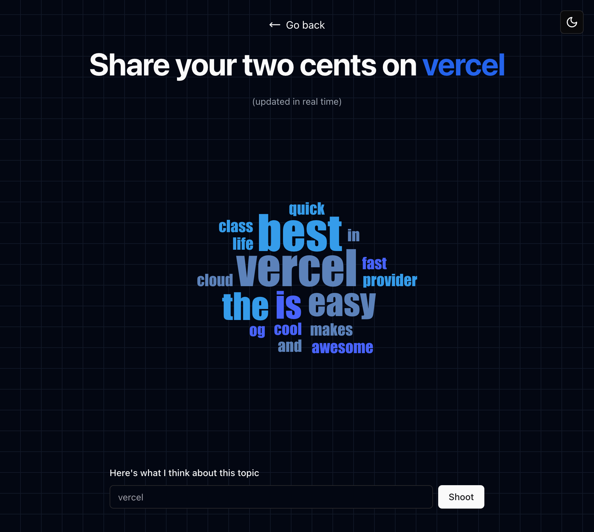

# **Two Cents**

Two-Cents enables real-time discussions on topics, letting users share opinions instantly. Built with Socket.IO, Next.js, and Upstash/Redis.



## **Features**

- Simple and intuitive interface for users to describe their opinions in realtime
- Built using Next.js and Socket IO for fast, efficient and realtime rendering
- Used Redis to provide low latency and high scalability for real-time applications

## **Getting Started**

### Development Server

To run the application you would need to run the client and server

#### To start the client, navigate to the client directory and run:

```bash
npm run dev
```

Open [http://localhost:3000](http://localhost:3000) with your browser to see the result.

#### To start the server, navigate to the server directory and run:

```bash
npm run dev
```

Use [http://localhost:8080](http://localhost:8080) as the server.

## **Contributing**

Contributions are welcome! Please refer to the [Next.js contributing guidelines](https://nextjs.org/docs/contributing) for more information.

## **License**

This project is licensed under the [MIT License](https://opensource.org/licenses/MIT).
